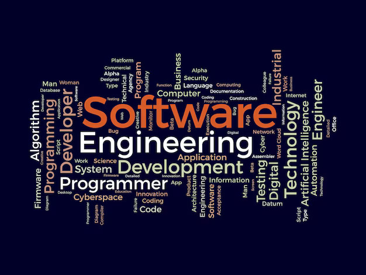

## Building Systems That Work (and Don't Fall Apart)

My interest in software engineering comes from the joy of building things that are both logical and creative — a place where systems thinking meets real-world problem solving. I’ve always been drawn to interactive projects, whether it's building a game inventory system in Unity, experimenting with computer vision to read bouldering routes, or creating menu interfaces as a beginner in web development. Over time, I’ve learned that good software isn't just about writing code — it's about designing systems that are maintainable, scalable, and built with other people in mind.

## Where I’m Going

As I move forward in my CS degree, I’m excited to go deeper into areas like full-stack development, computer vision, and AI. I want to work on projects that not only solve interesting technical problems but also connect to human experiences — like improving accessibility in climbing gyms, building real-time interfaces, or contributing to open-source educational tools. I’m particularly interested in developing skills in systems design, collaborative development with Git, and testing/debugging practices that reduce technical debt from the start.

## Software Engineering Is a Process, Not Just a Skillset

One thing I’ve learned from ICS 314 so far is how valuable *process* is — not just knowing how to code, but how to plan, test, iterate, and deliver. The Workout of the Day format showed me how much I can grow by setting time-boxed goals and learning from my failures. I also appreciate how much communication and clarity matter — whether it's writing a technical essay, submitting clean commits, or asking smart questions.

## What Comes Next

In the future, I hope to contribute to team projects with real users and constraints. Whether it’s through internships, capstone courses, or research, I want to challenge myself by taking on roles where I’m responsible for a part of something bigger. Software engineering feels like a long climb, but it’s the kind of challenge I want to keep pushing myself through — one problem, one pull-up, and one commit at a time.
