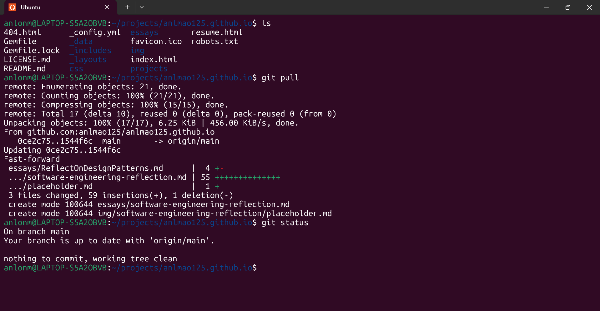

  

## More Than Just Web Development

Before I took ICS314, I had done some web development in high school, only going in-depth in HTML, CSS, and JavaScript. I didn’t encounter any type of tools back then, so I just thought of software engineering as mainly using those three languages. This class showed me that there’s an entire ecosystem of practices, tools, and principles that turn messy code into something maintainable, scalable, and — dare I say — enjoyable to work with.

Yes, I learned **web application development** using tools like **Bootstrap** and **React**, but that was just the surface. The real lessons were about the methods and mindsets that make those tools effective in a professional setting.

## Configuration Management — Staying in Control of the Chaos

One of the biggest eye-openers for me was **configuration management**, which is the practice of systematically handling changes in software so that integrity and traceability are maintained. 

In this class, that meant heavy use of **Git** for version control. Using `git push`, `git pull`, and branching wasn’t just about storing code online — it was about collaboration, history tracking, and having the confidence that I could experiment without breaking everything. Working in my **WSL environment** made this process smooth, allowing me to organize and store my projects efficiently with Bash commands.

Now, I can’t imagine starting a serious project without version control. Even outside web development — say, a data analysis project — Git would be my safety net, my time machine, and my collaboration hub all in one.

## Development Environments — Making the Tools Work for You

ICS314 also deepened my understanding of **development environments**, which are the combination of tools, configurations, and workflows you use to build software efficiently.

For me, this meant using **Bash** in WSL to navigate directories, manage files, run scripts, and automate repetitive tasks. It was a steep learning curve at first, but now these commands feel like second nature. Whether it’s compiling code, installing dependencies, or batch-renaming files, Bash saves me time and keeps my workflow fast and consistent.

This skill transfers far beyond web apps. Any programming or scripting project benefits from having a well-tuned environment that you actually enjoy working in.

## User Interface Frameworks — Creativity With Structure

Before this class, I thought front-end design was just “make it look nice.” Learning **UI frameworks** like Bootstrap taught me that good design is about *structure* as much as *style*. By working within a framework, I could quickly create responsive, accessible layouts — and then layer on my own creativity.

The framework didn’t limit me; it actually freed me to focus on features instead of fiddling with every pixel. Now, when I approach design, I think in terms of reusable components, consistent spacing, and scalability.

## The Bigger Picture

What ICS314 really taught me is that software engineering is about **process, not just product**. The tools and practices I’ve learned — configuration management, development environments, UI frameworks — aren’t tied to any single programming language or technology stack. They’re universal skills that will help me in any coding discipline.

Yes, building a functioning app is satisfying, but building it *well* — with version control, efficient tooling, and thoughtful design — is on a whole different level.

## Final Thoughts

Software engineering turned out to be more complex than I expected, but also far more interesting and rewarding. ICS314 didn’t just make me a better web developer; it made me a better problem-solver, collaborator, and designer.

And now, whether I’m working on a website, a script, or something entirely outside the browser, I know how to approach it with the mindset of a software engineer — organized, efficient, and maybe even a little stylish.
