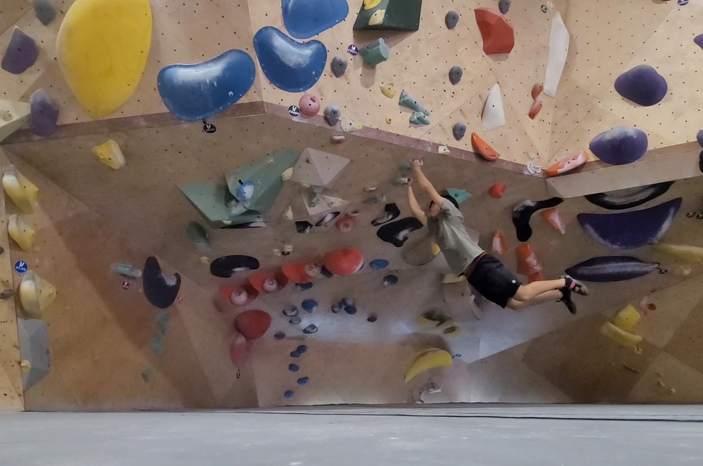

This project is an ongoing attempt to merge my passion for bouldering with computer vision and machine learning. The goal is to build a mobile app that can analyze images of indoor climbing walls, detect holds, and identify specific bouldering problems based on color, shape, and layout.

I'm currently focusing on the AI/computer vision backend. My plan includes:
- Using OpenCV and Python to detect climbing holds from gym wall photos
- Training a model to distinguish between different routes based on tape color, hold shapes, and configuration
- Exploring YOLOv8 or other object detection frameworks for better accuracy

This app will eventually help climbers:
- Digitally log their sends and attempts
- Discover user-submitted route beta
- Compare problems across gyms or sessions

The app is still in early stages, with the backend in prototype and model training underway.

🚧 *This is a solo project and still in development. Updates will be posted as features evolve.*
