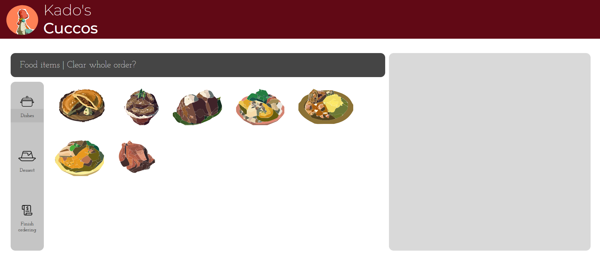

As part of a high school final project, I developed a multi-page web application simulating a digital restaurant menu and ordering system. The site featured stylized food items represented by SVGs, a functional navigation flow, and dynamic page behaviors using JavaScript.

**Key technical components:**
- JavaScript DOM manipulation to dynamically update content and styles
- Event listeners for interactivity (e.g., selection or page transitions)
- Use of `parentNode`, `childNodes`, and `getElementById()` to control page behavior
- Clean, responsive UI with consistent styling using CSS
- Multi-page flow with HTML linking between the menu and payment page

This project helped solidify my understanding of how HTML, CSS, and JavaScript work together to create interactive web experiences. It was one of the first projects where I fully controlled the site’s structure and logic from start to finish.

🖼️ *Custom food illustrations were added as SVG assets for a personalized visual touch.*
