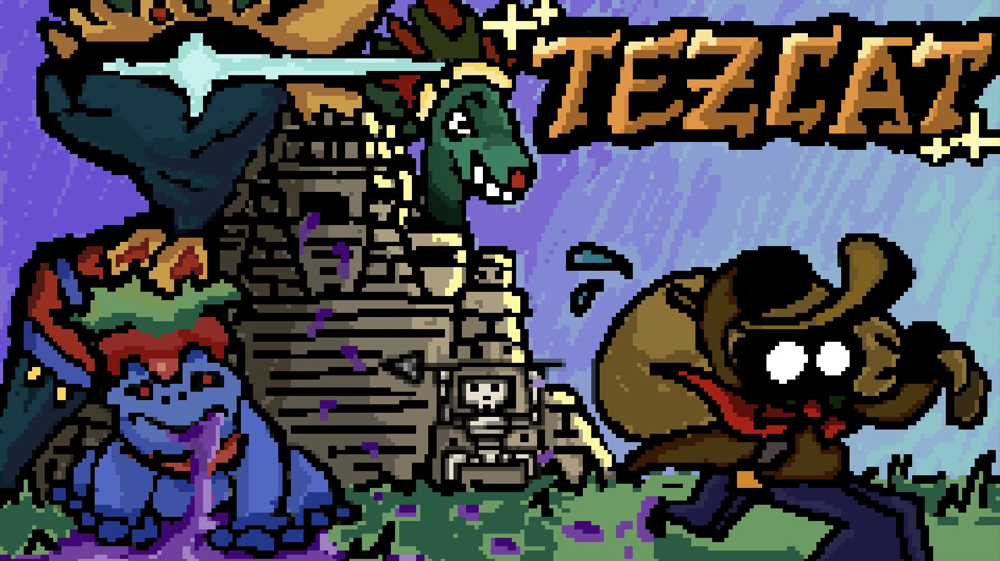

[Tezcat](https://uhmanoagamedev.itch.io/tezcat) is a 2D narrative puzzle game created by the UH Mānoa Game Dev club. The game explores themes of memory and identity through surreal environments, puzzle mechanics, and item-based interactions.

As a member of the development team, I was responsible for programming the game’s **inventory system** in Unity using C#. This included logic for item pickups, usage, and UI integration, enabling players to interact meaningfully with the world and solve narrative puzzles.

Through this project, I gained experience with:
- Unity scripting with C# for gameplay systems
- UI design for inventory interactions
- Collaboration in a multi-role student dev team using version control

Play it here:  
🎮 [https://uhmanoagamedev.itch.io/tezcat](https://uhmanoagamedev.itch.io/tezcat)

*Note: This was a collaborative student project. My contributions focused specifically on the inventory system implementation.*
